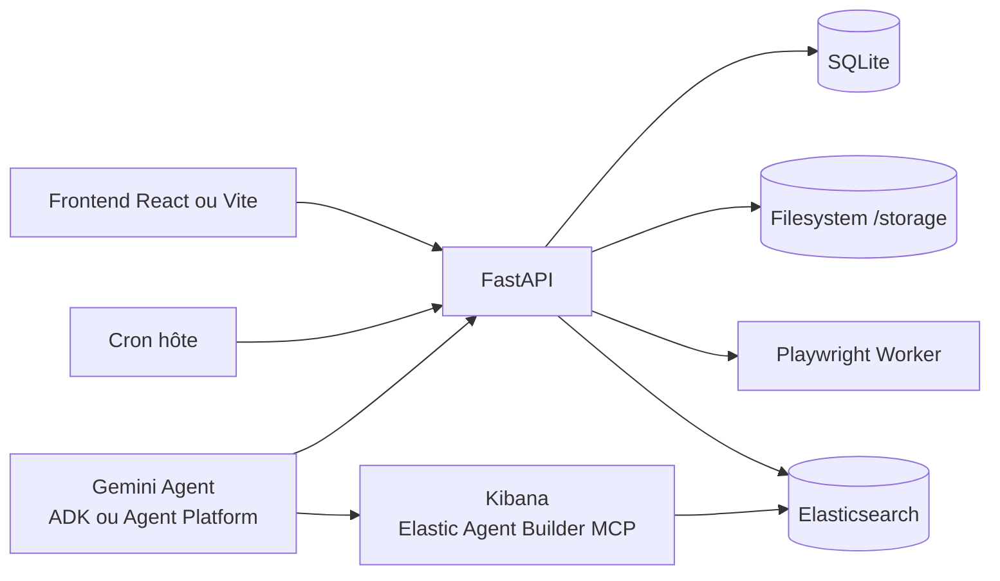
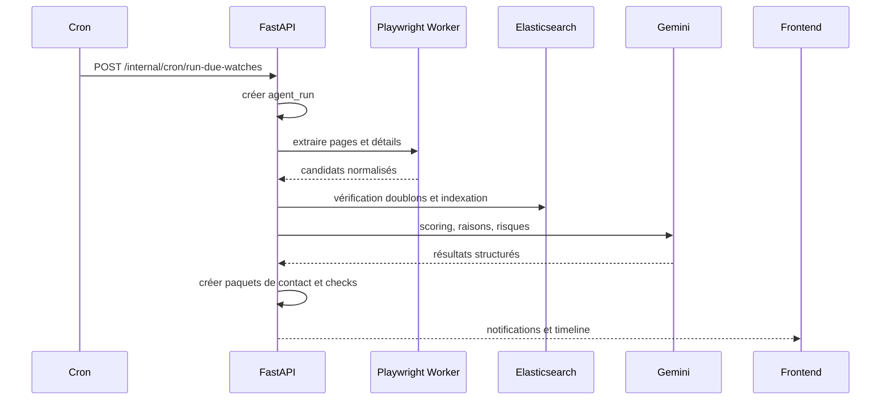
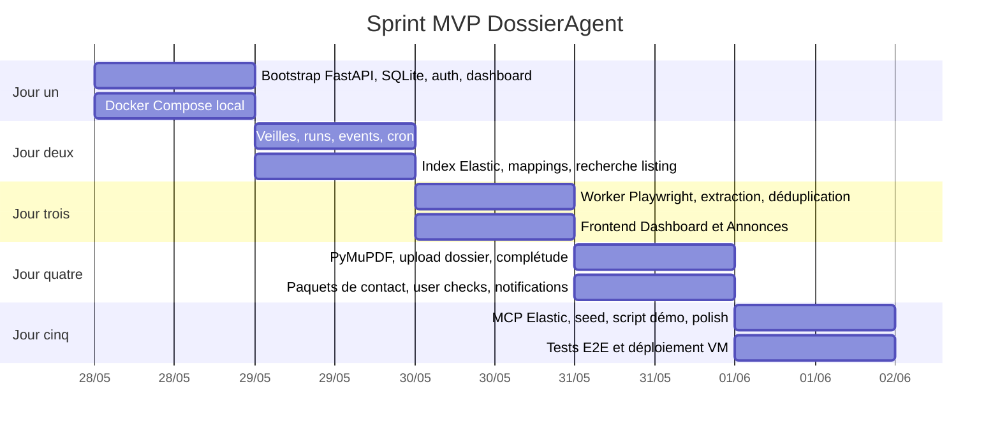
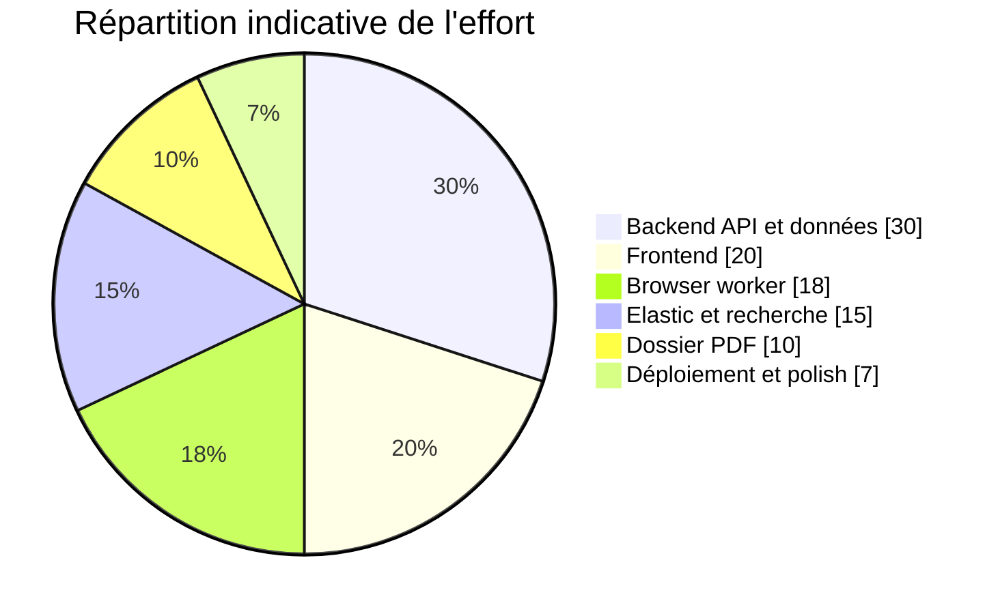

# Spécification complète de DossierAgent pour un MVP de hackathon

## Synthèse exécutive

DossierAgent doit être conçu comme un agent supervisé, pas comme un robot immobilier totalement autonome. Le MVP gagnant pour un hackathon n’est pas celui qui promet de remplir tous les formulaires du marché, mais celui qui démontre proprement une boucle complète et crédible : définir une veille, scanner des sources, éviter les doublons, qualifier les annonces, analyser un dossier, produire un paquet de contact, puis demander une validation explicite dans le frontend. Cette décomposition est cohérente avec les primitives actuelles de l’écosystème Google pour agents, où ADK et Gemini Enterprise Agent Platform structurent les agents autour de modèles, d’instructions, d’outils, d’état de session et d’observabilité. citeturn14view0turn14view1turn14view3

Sur le plan technique, la pile choisie est bonne pour un MVP local first : FastAPI donne une API rapide, typée et documentée automatiquement par OpenAPI, SQLite apporte un stockage embarqué et sans serveur, Elastic couvre la recherche textuelle, vectorielle et hybride, Playwright fournit une automatisation navigateur robuste, et PyMuPDF permet une extraction locale des PDF et de leurs blocs textuels. Pour un produit de démonstration, cette pile maximise la vitesse d’implémentation tout en gardant l’architecture suffisamment sérieuse pour être défendable devant un jury. citeturn7view0turn7view1turn19search4turn5view1turn5view3turn6view0turn8view0

Le point décisif, et probablement le plus important de tout ce rapport, concerne Elastic MCP. Aujourd’hui, Elastic recommande deux voies différentes : l’endpoint Agent Builder MCP pour les déploiements Elastic 9.2+ et Serverless, et l’ancien `mcp-elasticsearch` pour les versions plus anciennes. Le second est explicitement limité et déprécié dans le dépôt officiel. En conséquence, si votre objectif est d’être solide sur le critère “partner MCP”, le déploiement hackathon doit inclure Kibana et viser l’endpoint Agent Builder MCP à l’URL `{KIBANA_URL}/api/agent_builder/mcp`. Si vous vous contentez d’un Elasticsearch nu sans Kibana, vous vous mettez vous même sur la voie la moins convaincante pour la démonstration partenaire. citeturn22view0turn22view1turn20view1

Pour la recherche sémantique, le choix par défaut recommandé pour ce MVP est le suivant : SQLite reste la source de vérité opérationnelle, Elasticsearch reste l’index de recherche, et l’application génère elle même les embeddings côté client avec Gemini Embedding 2 puis les stocke dans des champs `dense_vector`. Elastic recommande bien le workflow `semantic_text` pour la recherche sémantique, mais ce workflow suppose un endpoint d’inférence configuré ou un service Elastic adapté. Pour un cluster autohébergé et un calendrier de cinq jours, l’option la plus sûre est de contrôler les embeddings dans l’application. De plus, `dense_vector` sert bien au kNN, mais ne supporte ni agrégations ni tri, donc tous les filtres métier doivent être conservés dans des champs scalaires classiques. citeturn5view1turn5view2turn5view3turn15view0turn12view0

Le MVP recommandé ajoute donc une seule nuance à la pile que vous avez arrêtée : Elastic doit être déployé avec Kibana pour la voie MCP recommandée. Le reste peut rester strictement conforme à vos choix : FastAPI, SQLite en WAL sur une seule machine, filesystem local, cron, Playwright worker, PyMuPDF, notifications frontend, et paquets de contact à la place du courriel. SQLite en mode WAL convient bien à ce cas d’usage mono instance, mais il dépend d’une mémoire partagée sur une même machine et n’est pas un bon candidat pour un partage sur système de fichiers réseau. citeturn22view1turn19search4turn9view0



L’architecture ci dessus matérialise la bonne séparation pour le hackathon : une voie opérationnelle déterministe, pilotée par FastAPI, et une voie agentique, pilotée par Gemini via des outils et, côté Elastic, par le MCP endpoint recommandé. Cette séparation réduit le risque produit et clarifie la démonstration. citeturn14view1turn14view3turn22view0turn22view1

## Objectifs produit et métriques

DossierAgent doit résoudre cinq problèmes précis. D’abord, centraliser la recherche à travers plusieurs sites en appliquant les mêmes critères. Ensuite, maintenir une mémoire exploitable des annonces déjà vues, rejetées ou réindexées. Puis, vérifier l’état du dossier locatif à partir de documents locaux. Ensuite encore, préparer un paquet de contact multilingue, sans envoi automatique. Enfin, donner à l’utilisateur un centre de commande unique avec des validations humaines explicites avant toute action sensible. Cette logique colle bien à la manière dont MCP et ADK pensent les outils, c’est à dire comme des opérations explicites, contrôlées, schématisées et appelables par un agent. citeturn17search5turn17search8turn14view0turn14view1

| Objectif produit | Résultat attendu | Cible MVP |
|---|---|---|
| Veille multi source | Une veille active avec exécution manuelle ou planifiée | 1 à 3 veilles par utilisateur |
| Mémoire de marché | Les annonces déjà vues sont ignorées ou requalifiées | > 85 % de suppression des doublons sur les seeds |
| Dossier locatif | Affichage d’un score de complétude et des pièces manquantes | 5 types de documents reconnus au lancement |
| Paquets de contact | Génération d’un message, de questions à poser et d’un résumé du dossier | 1 clic pour générer, 1 clic pour copier |
| Supervision | Aucune action sensible sans validation dans le frontend | 100 % des paquets marqués “à relire” |

Les user stories doivent rester peu nombreuses et très visibles dans le code et dans la démo. Une bonne règle pour ce MVP est de n’accepter que les stories qui peuvent être montrées de bout en bout avec données seedées ou extraites en direct.

| User story | Déclencheur | Réponse attendue |
|---|---|---|
| En tant qu’utilisateur, je définis une veille locative | Je saisis ville, budget, surface, fréquence | La veille est créée, planifiée et visible dans le tableau de bord |
| En tant qu’utilisateur, je lance une recherche immédiate | Je clique sur “Lancer maintenant” | Un run apparaît, scanne les sources, classe les résultats, notifie les nouveautés |
| En tant qu’utilisateur, je ne veux pas revoir les mêmes annonces | Une source republie un bien déjà vu | Le système marque doublon, repost ou annonce modifiée |
| En tant qu’utilisateur, je charge mon dossier | Je dépose des PDF | Le système extrait le texte, classifie les documents et calcule l’état de complétude |
| En tant qu’utilisateur, je veux contacter manuellement une agence | Je sélectionne une annonce forte | Le système prépare un paquet de contact à valider dans le frontend |

Les métriques de succès du hackathon doivent être à la fois techniques et démontrables. Je recommande de suivre les indicateurs suivants dans le tableau de bord de démo, avec un export JSON des runs :

| Métrique | Définition | Cible |
|---|---|---|
| Latence de scan | Temps entre déclenchement et résumé final | < 180 s pour 50 à 80 URL candidates |
| Taux de nouveauté utile | Nouvelles annonces considérées intéressantes / nouvelles annonces | > 20 % sur le seed de démo |
| Taux de suppression doublons | Doublons ou reposts évités / candidats vus | > 85 % |
| Couverture dossier | Documents requis identifiés correctement | > 80 % sur jeu de test contrôlé |
| Temps de préparation d’un paquet | Temps entre clic utilisateur et paquet prêt | < 10 s |
| Qualité perçue | L’utilisateur comprend pourquoi une annonce est recommandée | 100 % des cartes avec raisons et risques visibles |

Le principe de supervision humaine doit être explicite dans tout le produit. C’est aussi cohérent avec le protocole MCP, dont la documentation recommande que l’utilisateur puisse voir les outils exposés, constater quand ils sont invoqués, et confirmer les opérations. DossierAgent doit donc traiter les “user checks” comme un domaine de premier rang, pas comme un détail d’interface. citeturn17search5

## Spécification frontend

Le frontend doit être desktop first, dense, et orienté tâches. Le bon modèle n’est pas une interface “chat pur”, mais un poste de commande qui place le langage naturel au centre tout en gardant des panneaux latéraux pour l’état, les résultats, le dossier et les validations. Cela évite le piège de la démo bavarde et maximise la lisibilité du système.

### Structure générale

| Zone | Rôle | Contenu |
|---|---|---|
| Barre latérale gauche | Navigation | Tableau de bord, Veilles, Annonces, Dossier, Paquets de contact, Historique |
| Colonne centrale | Surface d’action | Champ de commande, timeline de run, listes et détails |
| Panneau droit | Contexte | Critères actifs, score dossier, notifications, user checks |
| Barre haute | Statut global | Veille active, prochain scan, dernier run, compteur de nouvelles annonces |

Les pages minimales à implémenter sont les suivantes :

| Page | Objectif | Composants principaux |
|---|---|---|
| Tableau de bord | Vue synthétique | `MissionHeader`, `CommandComposer`, `RunSummaryCards`, `PendingChecksPanel`, `RecommendedListingsPanel` |
| Veilles | Gérer les missions de scan | `WatchTable`, `CriteriaDrawer`, `ScheduleEditor`, `RunNowButton` |
| Annonces | Réviser et décider | `ListingTable`, `ListingFilters`, `ListingDetailPane`, `DecisionBar` |
| Dossier | Charger et analyser les pièces | `UploadDropzone`, `DocumentList`, `ReadinessCard`, `MissingDocsChecklist`, `PdfPreviewPane` |
| Paquets de contact | Préparer l’action manuelle | `PacketList`, `PacketEditor`, `QuestionsPanel`, `CopyActions`, `ReviewStatusBadge` |
| Historique | Auditer les runs | `RunTable`, `RunEventTimeline`, `TraceLinks`, `ExportJsonButton` |

### Composants détaillés

| Composant | Données affichées | Actions utilisateur | API |
|---|---|---|---|
| `CommandComposer` | Champ texte, suggestions, derniers prompts | Créer une veille, lancer un scan, demander une analyse dossier | `POST /agent/commands` |
| `RunEventTimeline` | Étapes, horodatage, message, sévérité | Ouvrir détail run, filtrer erreurs | `GET /agent-runs/{id}/events` |
| `ListingTable` | Titre, prix, surface, ville, score, statut | Sauvegarder, rejeter, marquer douteux | `GET /listings`, `PATCH /listings/{id}` |
| `ListingDetailPane` | Description, raisons du score, risques, historique de vues | Générer paquet de contact, reclasser | `GET /listings/{id}`, `POST /contact-packets` |
| `ReadinessCard` | Score dossier, pièces valides, pièces manquantes | Lancer une nouvelle analyse | `GET /dossier/readiness`, `POST /dossier/analyze` |
| `PdfPreviewPane` | Aperçu page, métadonnées, extraction texte | Ouvrir, supprimer, reclasser | `GET /dossier/documents/{id}`, `GET /dossier/documents/{id}/preview` |
| `PacketEditor` | Message, langue, ton, questions à poser | Éditer, copier, marquer utilisé | `GET/PATCH /contact-packets/{id}` |
| `PendingChecksPanel` | Liste des validations en attente | Approuver, rejeter, renvoyer à édition | `GET /user-checks`, `POST /user-checks/{id}/complete` |
| `NotificationCenter` | Nouveaux matchs, scans terminés, alertes dossier | Marquer comme lu | `GET /notifications`, `POST /notifications/{id}/read` |

### Layouts recommandés

Le tableau de bord doit être en trois panneaux, avec le champ de commande en haut et la timeline du dernier run juste en dessous.

```text
┌──────────────────────────────────────────────────────────────────────────────┐
│ DossierAgent   Veille active: Toulouse T2   Prochain scan: 18:30           │
├───────────────┬───────────────────────────────────────────┬──────────────────┤
│ Navigation    │ Commande                                  │ Contexte         │
│               │ [ Trouve moi des T2 à Toulouse...      ] │ Score dossier 78 │
│ Dashboard     │                                           │ 2 pièces manqu.  │
│ Veilles       │ Dernier run                               │ 3 checks en att. │
│ Annonces      │ • Scan démarré                            │                  │
│ Dossier       │ • 42 candidates lues                      │ Notifications    │
│ Packets       │ • 8 doublons ignorés                      │ • 2 nouveaux     │
│ Historique    │ • 5 nouvelles annonces                    │ • 1 doc invalide │
│               │ • 2 fortes recommandations                │                  │
├───────────────┼───────────────────────────────────────────┼──────────────────┤
│               │ Recommandations                           │ Checks           │
│               │ [Carte annonce] [Carte annonce]           │ [Relire packet]  │
└───────────────┴───────────────────────────────────────────┴──────────────────┘
```

La page Annonces doit utiliser un master detail classique. La table à gauche permet de trier et filtrer, le panneau de droite contient l’explication du score, les drapeaux de risque, et les actions.

```text
┌──────────────────────────────────────────────────────────────────────────────┐
│ Filtres: Toulouse | <= 850 € | >= 35 m² | Nouveautés                        │
├──────────────────────────────┬───────────────────────────────────────────────┤
│ Liste                        │ Détail annonce                                │
│ T2 Saint Cyprien   91        │ T2 Saint Cyprien proche métro                │
│ T2 Carmes          88        │ Prix: 790 € CC                               │
│ T1 bis Minimes     74        │ Surface: 39 m²                               │
│ Repost repéré      62        │ Raisons                                      │
│                              │ • Sous budget                                │
│                              │ • Surface au dessus du minimum               │
│                              │ • Mention métro                              │
│                              │ Risques                                      │
│                              │ • Charges non détaillées                     │
│                              │ • Disponibilité non précisée                 │
│                              │ [Sauvegarder] [Rejeter] [Générer packet]     │
└──────────────────────────────┴───────────────────────────────────────────────┘
```

La page Dossier doit être conçue autour d’une zone de dépôt, d’une liste de documents, et d’un panneau de complétude. Le point clé est d’afficher clairement ce qui manque et pourquoi.

```text
┌──────────────────────────────────────────────────────────────────────────────┐
│ Dossier                                                                     │
├────────────────────────────┬────────────────────────────┬────────────────────┤
│ Dépôt                      │ Documents                  │ Complétude         │
│ [ Glisser déposer ]        │ CNI.pdf           valide   │ Score: 78          │
│                            │ Fiche paie mars   valide   │ Valides            │
│ Pièces attendues           │ Fiche paie avril  valide   │ • Identité         │
│ • Identité                 │ Fiche paie mai    valide   │ • 3 fiches de paie │
│ • 3 fiches de paie         │ Contrat.docx      manque   │                    │
│ • Contrat de travail       │ Avis impôt 2024   obsolète │ À fournir          │
│ • Avis d’impôt récent      │                            │ • Contrat travail  │
│                            │ [Prévisualiser]            │ • Avis d’impôt     │
└────────────────────────────┴────────────────────────────┴────────────────────┘
```

### Interactions et états

Le frontend doit être pessimiste sur les actions et optimiste sur l’affichage. En pratique, cela signifie : boutons désactivés pendant les mutations, badges de statut explicites, rechargement ciblé des panneaux modifiés, et polling léger pour les runs, notifications et checks. Le polling suffit pour le MVP. SSE peut rester une amélioration après la démo.

Le composant le plus important est `CommandComposer`. Il doit accepter des commandes libres, mais afficher immédiatement le plan structuré que l’agent a compris : critères, fréquence, sources, et limites. Cela transforme la magie en système auditable. L’utilisateur doit pouvoir corriger avant validation.

Le second composant critique est `PendingChecksPanel`. Sans courriel dans le MVP, c’est lui qui matérialise la supervision. Toute proposition du système qui peut modifier le comportement du flux utilisateur doit produire un check : revoir un paquet de contact, confirmer un document douteux, accepter la mise à jour d’une veille, ou approuver un reclassement.

## Spécification backend et API

FastAPI est particulièrement adapté ici parce qu’il combine typage Python, validation Pydantic et documentation OpenAPI automatique. Par défaut, FastAPI expose l’interface Swagger sur `/docs`, ReDoc sur `/redoc`, et le schéma OpenAPI sur `/openapi.json`. Le mécanisme `response_model` permet aussi de filtrer la sortie selon le modèle déclaré, ce qui est utile pour éviter de renvoyer des champs sensibles par erreur. citeturn7view0turn7view1turn7view3

### Conventions d’API

| Sujet | Décision |
|---|---|
| Préfixe | `/api/v1` |
| Format | JSON pour presque tout, `multipart/form-data` pour les uploads |
| Auth | Bearer JWT simple, compte local, refresh token stocké côté serveur |
| Pagination | Pagination par `limit` et `cursor` |
| Horodatage | ISO 8601 UTC |
| Identifiants | `usr_`, `watch_`, `lst_`, `run_`, `doc_`, `pkt_`, `chk_` |
| Versionnement | Par préfixe d’URL et version d’index Elastic |
| Idempotence | En tête `Idempotency-Key` sur `run-now`, `contact-packets`, `user-checks/complete` |

Pour l’authentification, une implémentation locale JWT avec OAuth2 Bearer suffit. FastAPI documente explicitement ce modèle et laisse le choix des bibliothèques de hash et de JWT sans imposer une base de données particulière. Pour le hackathon, il faut rester simple : un compte local par démo, accès court, refresh token revocable. citeturn7view2

Pour les uploads de dossier, il faut utiliser `multipart/form-data`. FastAPI gère nativement les fichiers et les champs de formulaire dans la même route via `File`, `Form` et `UploadFile`. En revanche, on ne peut pas mélanger dans une même requête un corps JSON classique et un upload multipart, ce qui est une contrainte du protocole HTTP, pas de FastAPI. citeturn25search1

### Format d’erreur

Toutes les erreurs applicatives doivent utiliser la même enveloppe :

```json
{
  "error": {
    "code": "listing_not_found",
    "message": "Listing introuvable.",
    "details": {
      "listing_id": "lst_123"
    },
    "trace_id": "trc_9d8f4",
    "retryable": false
  }
}
```

Codes HTTP recommandés :

| Code | Usage |
|---|---|
| 400 | Paramètres invalides |
| 401 | Authentification absente ou invalide |
| 403 | Ressource hors périmètre utilisateur |
| 404 | Ressource inexistante |
| 409 | Conflit d’état, par exemple run déjà en cours |
| 422 | Validation métier structurée |
| 500 | Erreur interne |

### Endpoints principaux

| Méthode | Route | But |
|---|---|---|
| `POST` | `/auth/login` | Obtenir `access_token` et `refresh_token` |
| `POST` | `/auth/refresh` | Renouveler le token |
| `GET` | `/me` | Profil courant |
| `GET` | `/dashboard` | Vue agrégée du centre de commande |
| `POST` | `/agent/commands` | Traduire une commande libre en action structurée |
| `POST` | `/criteria` | Créer des critères de recherche |
| `GET` | `/criteria` | Lister les critères |
| `POST` | `/market-watches` | Créer une veille |
| `GET` | `/market-watches` | Lister les veilles |
| `PATCH` | `/market-watches/{watch_id}` | Mettre à jour statut, horaires, critères |
| `POST` | `/market-watches/{watch_id}/run-now` | Déclencher un run immédiat |
| `GET` | `/agent-runs/{run_id}` | Détail d’un run |
| `GET` | `/agent-runs/{run_id}/events` | Timeline d’événements |
| `GET` | `/listings` | Recherche et filtre d’annonces |
| `GET` | `/listings/{listing_id}` | Détail annonce |
| `PATCH` | `/listings/{listing_id}` | Décision utilisateur |
| `POST` | `/listings/import-url` | Ajouter une URL manuelle à extraire |
| `POST` | `/dossier/documents` | Upload de document |
| `GET` | `/dossier/documents` | Lister les documents |
| `GET` | `/dossier/documents/{doc_id}` | Métadonnées d’un document |
| `GET` | `/dossier/documents/{doc_id}/preview` | Flux de prévisualisation authentifié |
| `DELETE` | `/dossier/documents/{doc_id}` | Suppression logique |
| `POST` | `/dossier/analyze` | Recalcul de la complétude |
| `GET` | `/dossier/readiness` | État de complétude courant |
| `POST` | `/contact-packets` | Générer un paquet de contact |
| `GET` | `/contact-packets` | Lister les paquets |
| `GET` | `/contact-packets/{packet_id}` | Détail paquet |
| `PATCH` | `/contact-packets/{packet_id}` | Éditer un paquet |
| `POST` | `/contact-packets/{packet_id}/mark-used` | Marquer utilisé |
| `GET` | `/user-checks` | Lister les validations |
| `POST` | `/user-checks/{check_id}/complete` | Valider ou refuser |
| `GET` | `/notifications` | Lister les notifications |
| `POST` | `/notifications/{id}/read` | Marquer lue |
| `POST` | `/internal/cron/run-due-watches` | Route appelée par cron |
| `POST` | `/internal/browser/extract` | Route privée pour le worker navigateur |

### Exemples de requêtes et réponses

Créer une veille à partir d’une commande libre :

```json
POST /api/v1/agent/commands
Authorization: Bearer <token>

{
  "message": "Trouve moi des locations à Toulouse sous 850 euros, au moins 35 m2, deux fois par jour."
}
```

```json
{
  "agent_run_id": "run_001",
  "status": "completed",
  "intent": "create_market_watch",
  "created_resources": {
    "criteria_id": "crit_001",
    "market_watch_id": "watch_001"
  },
  "preview": {
    "mode": "rent",
    "cities": ["Toulouse"],
    "budget_max": 850,
    "surface_min": 35,
    "frequency": "twice_daily"
  }
}
```

Déclencher un scan :

```json
POST /api/v1/market-watches/watch_001/run-now
Authorization: Bearer <token>
Idempotency-Key: a85f6b2d
```

```json
{
  "run_id": "run_002",
  "status": "running",
  "summary": {
    "scanned_candidates": 0,
    "new_listings": 0
  }
}
```

Résumé de tableau de bord :

```json
GET /api/v1/dashboard
Authorization: Bearer <token>
```

```json
{
  "current_watch": {
    "id": "watch_001",
    "name": "Toulouse T2",
    "status": "active",
    "next_run_at": "2026-05-27T18:30:00+02:00"
  },
  "latest_run": {
    "id": "run_002",
    "status": "completed",
    "stats": {
      "scanned": 42,
      "duplicates": 8,
      "reposts": 3,
      "new": 5,
      "strong_matches": 2
    }
  },
  "dossier": {
    "readiness_score": 78,
    "missing_docs": ["employment_contract", "latest_tax_notice"]
  },
  "pending_checks": 3,
  "notifications_unread": 4
}
```

Upload d’un document :

```http
POST /api/v1/dossier/documents
Authorization: Bearer <token>
Content-Type: multipart/form-data
```

Champs :

```text
file=<binary PDF>
declared_type=payslip
owner_type=user
```

Réponse :

```json
{
  "document_id": "doc_013",
  "status": "uploaded",
  "filename": "payslip_may.pdf",
  "analysis_status": "queued"
}
```

Génération d’un paquet de contact :

```json
POST /api/v1/contact-packets
Authorization: Bearer <token>

{
  "listing_id": "lst_009",
  "language": "fr",
  "tone": "polite_direct",
  "include_dossier_summary": true
}
```

```json
{
  "id": "pkt_004",
  "listing_id": "lst_009",
  "status": "ready_for_review",
  "message_draft": "Bonjour, je vous contacte au sujet du T2 à Saint Cyprien...",
  "questions_to_ask": [
    "Les charges sont elles incluses ?",
    "Une visite est elle possible cette semaine ?"
  ],
  "dossier_summary": {
    "can_contact": true,
    "can_send_full_dossier": false,
    "missing_documents": ["employment_contract"]
  }
}
```

Compléter un user check :

```json
POST /api/v1/user-checks/chk_007/complete
Authorization: Bearer <token>

{
  "decision": "approved",
  "note": "Message correct, je vais le copier."
}
```

```json
{
  "id": "chk_007",
  "status": "completed",
  "completed_with": "approved"
}
```

### Schéma SQLite recommandé

SQLite est pertinent ici parce qu’il est embarqué, serveurless, zéro configuration et stocké dans un fichier unique. Il faut cependant activer WAL, garder la base sur une seule machine, et éviter tout système de fichiers partagé entre plusieurs hôtes. Le fichier `-wal` fait partie de l’état persistant lors des sauvegardes à chaud. citeturn19search4turn19search0turn9view0turn19search6

```sql
PRAGMA journal_mode=WAL;
PRAGMA foreign_keys=ON;
PRAGMA synchronous=NORMAL;

CREATE TABLE users (
  id TEXT PRIMARY KEY,
  email TEXT UNIQUE NOT NULL,
  password_hash TEXT NOT NULL,
  display_name TEXT NOT NULL,
  created_at TEXT NOT NULL,
  updated_at TEXT NOT NULL
);

CREATE TABLE refresh_tokens (
  id TEXT PRIMARY KEY,
  user_id TEXT NOT NULL REFERENCES users(id),
  token_hash TEXT NOT NULL,
  expires_at TEXT NOT NULL,
  revoked_at TEXT,
  created_at TEXT NOT NULL
);

CREATE TABLE search_criteria (
  id TEXT PRIMARY KEY,
  user_id TEXT NOT NULL REFERENCES users(id),
  mode TEXT NOT NULL,
  cities_json TEXT NOT NULL,
  districts_json TEXT NOT NULL DEFAULT '[]',
  budget_min REAL,
  budget_max REAL,
  surface_min REAL,
  rooms_min REAL,
  languages_json TEXT NOT NULL DEFAULT '["fr"]',
  filters_json TEXT NOT NULL DEFAULT '{}',
  created_at TEXT NOT NULL,
  updated_at TEXT NOT NULL
);

CREATE TABLE market_watches (
  id TEXT PRIMARY KEY,
  user_id TEXT NOT NULL REFERENCES users(id),
  criteria_id TEXT NOT NULL REFERENCES search_criteria(id),
  name TEXT NOT NULL,
  status TEXT NOT NULL,
  frequency TEXT NOT NULL,
  next_run_at TEXT,
  last_run_at TEXT,
  source_config_json TEXT NOT NULL DEFAULT '{}',
  created_at TEXT NOT NULL,
  updated_at TEXT NOT NULL
);

CREATE TABLE listings (
  id TEXT PRIMARY KEY,
  user_id TEXT NOT NULL REFERENCES users(id),
  watch_id TEXT REFERENCES market_watches(id),
  source TEXT NOT NULL,
  source_url TEXT NOT NULL,
  canonical_url TEXT NOT NULL,
  canonical_url_hash TEXT NOT NULL,
  source_listing_id TEXT,
  title TEXT NOT NULL,
  description TEXT,
  city TEXT,
  district TEXT,
  postal_code TEXT,
  price REAL,
  currency TEXT DEFAULT 'EUR',
  surface REAL,
  rooms REAL,
  agency_name TEXT,
  contact_hint TEXT,
  composite_fingerprint TEXT NOT NULL,
  duplicate_of_listing_id TEXT,
  status TEXT NOT NULL,
  fit_score REAL,
  fit_level TEXT,
  risk_flags_json TEXT NOT NULL DEFAULT '[]',
  explanation_json TEXT NOT NULL DEFAULT '[]',
  raw_payload_json TEXT NOT NULL DEFAULT '{}',
  first_seen_at TEXT NOT NULL,
  last_seen_at TEXT NOT NULL,
  created_at TEXT NOT NULL,
  updated_at TEXT NOT NULL
);

CREATE INDEX idx_listings_user_status ON listings(user_id, status);
CREATE INDEX idx_listings_canonical_hash ON listings(canonical_url_hash);
CREATE INDEX idx_listings_fingerprint ON listings(composite_fingerprint);
CREATE INDEX idx_listings_source_listing_id ON listings(source, source_listing_id);

CREATE TABLE dossier_documents (
  id TEXT PRIMARY KEY,
  user_id TEXT NOT NULL REFERENCES users(id),
  filename TEXT NOT NULL,
  storage_path TEXT NOT NULL,
  mime_type TEXT NOT NULL,
  file_size INTEGER NOT NULL,
  sha256 TEXT NOT NULL,
  declared_type TEXT,
  detected_type TEXT,
  detected_owner_type TEXT,
  page_count INTEGER,
  status TEXT NOT NULL,
  extracted_text_path TEXT,
  issues_json TEXT NOT NULL DEFAULT '[]',
  warnings_json TEXT NOT NULL DEFAULT '[]',
  created_at TEXT NOT NULL,
  updated_at TEXT NOT NULL
);

CREATE TABLE dossier_snapshots (
  id TEXT PRIMARY KEY,
  user_id TEXT NOT NULL REFERENCES users(id),
  readiness_score REAL NOT NULL,
  can_contact INTEGER NOT NULL,
  can_send_full_dossier INTEGER NOT NULL,
  missing_documents_json TEXT NOT NULL DEFAULT '[]',
  valid_documents_json TEXT NOT NULL DEFAULT '[]',
  recommendations_json TEXT NOT NULL DEFAULT '[]',
  created_at TEXT NOT NULL
);

CREATE TABLE contact_packets (
  id TEXT PRIMARY KEY,
  user_id TEXT NOT NULL REFERENCES users(id),
  listing_id TEXT NOT NULL REFERENCES listings(id),
  language TEXT NOT NULL,
  tone TEXT NOT NULL,
  status TEXT NOT NULL,
  message_draft TEXT NOT NULL,
  questions_json TEXT NOT NULL DEFAULT '[]',
  dossier_summary_json TEXT NOT NULL DEFAULT '{}',
  used_at TEXT,
  used_channel TEXT,
  created_at TEXT NOT NULL,
  updated_at TEXT NOT NULL
);

CREATE TABLE user_checks (
  id TEXT PRIMARY KEY,
  user_id TEXT NOT NULL REFERENCES users(id),
  type TEXT NOT NULL,
  resource_type TEXT NOT NULL,
  resource_id TEXT NOT NULL,
  title TEXT NOT NULL,
  summary TEXT NOT NULL,
  status TEXT NOT NULL,
  payload_json TEXT NOT NULL DEFAULT '{}',
  completed_with TEXT,
  completed_note TEXT,
  created_at TEXT NOT NULL,
  completed_at TEXT
);

CREATE TABLE notifications (
  id TEXT PRIMARY KEY,
  user_id TEXT NOT NULL REFERENCES users(id),
  type TEXT NOT NULL,
  title TEXT NOT NULL,
  body TEXT NOT NULL,
  resource_type TEXT,
  resource_id TEXT,
  read_at TEXT,
  created_at TEXT NOT NULL
);

CREATE TABLE agent_runs (
  id TEXT PRIMARY KEY,
  user_id TEXT NOT NULL REFERENCES users(id),
  watch_id TEXT REFERENCES market_watches(id),
  trigger_type TEXT NOT NULL,
  intent TEXT NOT NULL,
  status TEXT NOT NULL,
  current_step TEXT,
  summary_json TEXT NOT NULL DEFAULT '{}',
  error_json TEXT,
  created_at TEXT NOT NULL,
  updated_at TEXT NOT NULL,
  completed_at TEXT
);

CREATE TABLE agent_events (
  id TEXT PRIMARY KEY,
  run_id TEXT NOT NULL REFERENCES agent_runs(id),
  user_id TEXT NOT NULL REFERENCES users(id),
  type TEXT NOT NULL,
  severity TEXT NOT NULL,
  message TEXT NOT NULL,
  payload_json TEXT NOT NULL DEFAULT '{}',
  created_at TEXT NOT NULL
);

CREATE INDEX idx_agent_events_run ON agent_events(run_id, created_at);
```

### Extrait OpenAPI

FastAPI permet d’enrichir le schéma OpenAPI avec `response_model`, réponses additionnelles et exemples JSON. Il faut s’en servir, parce que le jury ouvrira vraisemblablement `/docs` avant d’ouvrir le code. citeturn7view4turn25search12

```yaml
openapi: 3.1.0
info:
  title: DossierAgent API
  version: 1.0.0
paths:
  /api/v1/market-watches/{watch_id}/run-now:
    post:
      summary: Lance immédiatement une veille
      security:
        - bearerAuth: []
      parameters:
        - in: path
          name: watch_id
          required: true
          schema:
            type: string
      responses:
        "202":
          description: Run accepté
          content:
            application/json:
              schema:
                type: object
                properties:
                  run_id:
                    type: string
                  status:
                    type: string
                    enum: [queued, running]
        "409":
          description: Un run est déjà actif
          content:
            application/json:
              schema:
                $ref: "#/components/schemas/ErrorEnvelope"
components:
  securitySchemes:
    bearerAuth:
      type: http
      scheme: bearer
      bearerFormat: JWT
  schemas:
    ErrorEnvelope:
      type: object
      properties:
        error:
          type: object
          properties:
            code: { type: string }
            message: { type: string }
            details: { type: object }
            trace_id: { type: string }
            retryable: { type: boolean }
```

## Recherche, indices Elastic et intégration MCP

Elastic doit jouer deux rôles distincts. Le premier est un rôle déterministe : indexation, filtrage, recherche hybride, détection de similarité. Le second est un rôle agentique : exposition de capacités de recherche et d’analyse via MCP pour la démonstration partenaire. Mélanger ces deux rôles dans la même couche de code rend le système plus fragile. Il faut donc conserver une voie REST directe pour l’application et une voie MCP dédiée à l’orchestrateur Gemini. citeturn22view0turn22view1turn16view0turn17search5

### Choix de stratégie sémantique

| Option | Ce qu’elle apporte | Coût d’intégration | Recommandation MVP |
|---|---|---|---|
| `dense_vector` + embeddings générés par l’app | Contrôle total, fonctionne bien en autohébergé, compatible kNN | Faible à moyen | Oui, par défaut |
| `semantic_text` | Workflow recommandé par Elastic, inférence à l’ingestion avec réglages par défaut | Moyen à élevé | Optionnel, seulement si l’inférence Elastic est prête |
| Pure full text BM25 | Très simple | Faible | Insuffisant seul |

Elastic recommande le workflow `semantic_text` comme voie de référence pour la recherche sémantique, parce qu’il simplifie l’inférence à l’ingestion et la recherche via Query DSL ou ES|QL. Mais pour un cluster local ou VM où vous voulez aller vite, le mode “bring your own vectors” avec `dense_vector` reste plus simple à maîtriser. C’est particulièrement vrai quand vous utilisez déjà Gemini pour générer vos embeddings. citeturn5view1turn5view2turn15view0

Gemini Embedding 2 est aujourd’hui une bonne option pour cette voie, car il est conçu pour la récupération complexe, produit par défaut des vecteurs de 3072 dimensions, accepte une `output_dimensionality` réduite, et est disponible en multirégion Europe. Pour ce MVP, je recommande `output_dimensionality=768` sur des chunks textuels, afin de réduire la taille des documents indexés et la pression mémoire sur Elasticsearch. citeturn12view0

### Mappings Elastic recommandés

Le point central à ne pas rater est le suivant : `dense_vector` sert au kNN, mais il ne supporte pas agrégations ni tri. Il faut donc conserver les champs métier dans des types classiques pour les filtres et l’interface : `price`, `surface`, `status`, `city`, `district`, `first_seen_at`, `fit_score`. citeturn5view3

Mapping `listings_v1` :

```json
PUT listings_v1
{
  "mappings": {
    "properties": {
      "listing_id": { "type": "keyword" },
      "user_id": { "type": "keyword" },
      "watch_id": { "type": "keyword" },
      "source": { "type": "keyword" },
      "source_url": { "type": "keyword" },
      "canonical_url": { "type": "keyword" },
      "canonical_url_hash": { "type": "keyword" },
      "source_listing_id": { "type": "keyword" },
      "composite_fingerprint": { "type": "keyword" },
      "title": { "type": "text" },
      "description": { "type": "text" },
      "city": { "type": "keyword" },
      "district": { "type": "keyword" },
      "postal_code": { "type": "keyword" },
      "agency_name": { "type": "keyword" },
      "price": { "type": "float" },
      "surface": { "type": "float" },
      "rooms": { "type": "float" },
      "status": { "type": "keyword" },
      "fit_score": { "type": "float" },
      "first_seen_at": { "type": "date" },
      "last_seen_at": { "type": "date" },
      "listing_vector": {
        "type": "dense_vector",
        "dims": 768,
        "index": true,
        "similarity": "cosine"
      },
      "risk_flags": {
        "type": "keyword"
      }
    }
  }
}
```

Mapping `documents_v1` :

```json
PUT documents_v1
{
  "mappings": {
    "properties": {
      "document_id": { "type": "keyword" },
      "user_id": { "type": "keyword" },
      "filename": { "type": "keyword" },
      "declared_type": { "type": "keyword" },
      "detected_type": { "type": "keyword" },
      "status": { "type": "keyword" },
      "content": { "type": "text" },
      "content_vector": {
        "type": "dense_vector",
        "dims": 768,
        "index": true,
        "similarity": "cosine"
      },
      "page_count": { "type": "integer" },
      "created_at": { "type": "date" }
    }
  }
}
```

### Recherche hybride

Elastic documente la recherche hybride comme la combinaison de recherche full text et de recherche sémantique, et recommande les workflows `semantic_text` pour ce cas. Pour un MVP avec `dense_vector`, la bonne adaptation est d’utiliser RRF pour fusionner un rang lexical et un rang vectoriel. RRF est intéressant ici parce qu’il ne demande pas de tuning lourd et fonctionne même si les signaux de pertinence sont hétérogènes. citeturn4search3turn5view4

Requête conceptuelle :

```json
POST listings_v1/_search
{
  "retriever": {
    "rrf": {
      "retrievers": [
        {
          "standard": {
            "query": {
              "bool": {
                "filter": [
                  { "term": { "user_id": "usr_001" } },
                  { "term": { "city": "Toulouse" } },
                  { "range": { "price": { "lte": 850 } } },
                  { "range": { "surface": { "gte": 35 } } }
                ],
                "must": [
                  { "multi_match": { "query": "métro balcon calme", "fields": ["title", "description"] } }
                ]
              }
            }
          }
        },
        {
          "knn": {
            "field": "listing_vector",
            "query_vector": [/* embedding */],
            "k": 40,
            "num_candidates": 150
          }
        }
      ],
      "rank_window_size": 50,
      "rank_constant": 20
    }
  }
}
```

### Intégration Elastic MCP

Le chemin recommandé est d’exposer Elastic via l’endpoint Agent Builder MCP de Kibana. L’URL officielle est `{KIBANA_URL}/api/agent_builder/mcp`, avec une variante par Space si nécessaire. Les clients MCP typiques utilisent `mcp-remote` et un header `Authorization: ApiKey ...`. Les permissions doivent être limitées aux index nécessaires, avec les privilèges Kibana adéquats pour Agent Builder. citeturn22view1

Configuration type :

```json
{
  "mcpServers": {
    "elastic-agent-builder": {
      "command": "npx",
      "args": [
        "mcp-remote",
        "${KIBANA_URL}/api/agent_builder/mcp",
        "--header",
        "Authorization:${AUTH_HEADER}"
      ],
      "env": {
        "KIBANA_URL": "https://elastic.example.com",
        "AUTH_HEADER": "ApiKey ${API_KEY}"
      }
    }
  }
}
```

Si vous tombez sur un blocage de disponibilité ou de licence pendant le hackathon, le plan B est l’ancien `mcp-server-elasticsearch`, mais il faut le traiter exactement comme un plan B. Son dépôt officiel indique qu’il est déprécié et qu’il est limité à quelques outils, notamment `list_indices`, `get_mappings`, `search`, `esql` et `get_shards`. C’est suffisant pour une démo de lecture et d’analyse, mais moins crédible qu’un endpoint Agent Builder actuel. citeturn20view1turn20view0turn22view0

Au niveau protocolaire, MCP suit un modèle hôte, client, serveur, s’appuie sur JSON RPC, et définit aujourd’hui `stdio` et `Streamable HTTP` comme transports standard. Pour un endpoint HTTP, la spécification insiste sur la validation de l’en tête `Origin`, l’authentification, et un binding local lorsqu’on héberge un serveur local. Cela implique une règle claire pour DossierAgent : n’exposez aucun serveur MCP maison publiquement sans garde fous. citeturn16view0turn16view1

## Orchestration agentique, navigateur et algorithmes

ADK définit l’agent comme une unité d’exécution autonome composée d’un modèle, d’instructions et éventuellement d’outils. ADK prévoit aussi les workflows multi agents quand les instructions deviennent trop longues ou quand on veut découper les responsabilités. DossierAgent doit suivre exactement cette logique : un seul agent monolithique au tout début, puis séparation en agents spécialisés dès que les comportements deviennent ambigus. citeturn14view0turn14view1

### Outils internes

| Outil | Entrée | Sortie | Effet |
|---|---|---|---|
| `parse_command` | message libre | intention structurée | aucun |
| `run_market_watch` | `watch_id` | `run_id`, résumé | crée run, events, notifications |
| `extract_listing_urls` | source, critères | liste d’URL | aucun |
| `extract_listing_details` | URL | annonce normalisée | aucun |
| `deduplicate_listing` | annonce normalisée | décision de doublon | peut enrichir l’existant |
| `rank_listing` | annonce + critères | score, raisons, risques | met à jour listing |
| `analyse_dossier` | `user_id` ou `doc_ids` | snapshot de complétude | crée snapshot |
| `build_contact_packet` | `listing_id`, langue | paquet de contact | crée user check |
| `create_notification` | type, message | notification | écrit notification |

### Contrats de prompt

Même en hackathon, les prompts doivent être traités comme des contrats.

Prompt du classeur d’annonces :

```text
Tu évalues une annonce immobilière pour une recherche locative.
Retourne uniquement du JSON.
N’invente jamais une donnée manquante.
Si les charges, la disponibilité, l’adresse précise ou le contact ne sont pas explicitement présents, ajoute un drapeau de risque.
Le score final doit être compris entre 0 et 100.
```

Prompt de paquet de contact :

```text
Tu rédiges un message de prise de contact supervisé.
Retourne uniquement du JSON.
N’affirme jamais qu’un document est joint.
N’affirme jamais que le dossier est complet sans preuve.
Reste concis, poli, direct, et utilise la langue demandée.
```

Prompt d’analyse dossier :

```text
Tu classes des documents locatifs extraits localement.
Retourne uniquement du JSON.
N’édite jamais un document.
Marque clairement l’incertitude si le texte est partiel, mal ordonné ou illisible.
Indique les pièces manquantes et les documents possiblement obsolètes.
```

### Cycle de vie d’un run



États minimaux :

| Domaine | États |
|---|---|
| `agent_run.status` | `queued`, `running`, `waiting_for_review`, `completed`, `failed`, `cancelled` |
| `listing.status` | `new`, `saved`, `recommended`, `rejected`, `duplicate`, `repost`, `trash`, `archived` |
| `document.status` | `uploaded`, `extracting`, `classified`, `valid`, `needs_review`, `invalid`, `deleted` |
| `contact_packet.status` | `draft`, `ready_for_review`, `approved`, `rejected`, `used` |
| `user_check.status` | `pending`, `completed`, `expired` |

### Browser worker Playwright

Playwright supporte Chromium, WebKit et Firefox, fonctionne sous Windows, Linux et macOS, localement ou en CI, et fournit une API Python synchrone ou asynchrone. Ses locators sont la pièce centrale de l’auto waiting et de la retryability. Il sait aussi capturer des screenshots, vidéos et traces, avec un Trace Viewer utile pour le débogage. Tout cela en fait le bon choix pour votre worker navigateur. citeturn6view0turn18search0turn18search4turn18search1turn18search14

Je recommande quatre modes d’extraction, mais seulement deux en production du hackathon :

| Mode | Description | Statut MVP |
|---|---|---|
| URL directe | On extrait une page fiche connue à partir d’une URL | Oui |
| Page liste | On lit une page de résultats et on récupère des liens de fiches | Oui |
| Fallback visuel | Screenshot de secours puis extraction LLM ou règles | Optionnel |
| Agent navigateur libre | Navigation complexe multi étapes | Non pour le MVP |

Architecture du worker :

| Élément | Responsabilité |
|---|---|
| `BrowserJob` | `job_id`, `source`, `mode`, `criteria`, `timeout` |
| `SourceAdapter` | Décrire comment ouvrir un site donné |
| `ListPageExtractor` | Extraire liens et métadonnées de cartes |
| `DetailPageExtractor` | Extraire champs d’une fiche |
| `ArtifactWriter` | Sauver HTML, screenshot, trace, JSON normalisé |
| `ComplianceGuard` | Respecter allowlist, délais, refus de bypass |

Règles de conception :

| Règle | Décision |
|---|---|
| Captcha | Refus, jamais de contournement |
| Login | Hors périmètre MVP |
| Robots et conditions d’usage | Respect strict, sources limitées au seed et aux URLs fournies |
| Traçabilité | Sauvegarder screenshot et JSON de sortie pour chaque erreur |
| Tolérance à l’échec | Marquer source en `degraded`, ne pas bloquer tout le run |

Playwright est également très bon pour les tests du frontend, via son plugin Pytest côté Python et des workflows CI classiques. Pour un hackathon, cela permet de réutiliser l’outil à la fois comme worker d’extraction contrôlée et comme suite E2E sur l’interface. citeturn6view0turn6view1turn18search14

### Algorithme de déduplication

La déduplication doit être hiérarchique, pas “IA first”.

**Étape exacte**

1. normaliser l’URL canonique  
2. comparer `canonical_url_hash`  
3. comparer `source + source_listing_id`

**Étape quasi exacte**

1. construire `composite_fingerprint = city + district + price + surface + agency_name + normalized_title`  
2. comparer `composite_fingerprint`  
3. si collision partielle, calculer similarité textuelle et deltas numériques

**Décisions**

| Décision | Condition |
|---|---|
| `duplicate` | URL canonique ou identifiant source identique |
| `repost` | même bien, URL différente, texte très proche |
| `changed_listing` | même bien, prix ou surface légèrement modifiés |
| `new` | aucune proximité suffisante |

Pseudo formule de similarité :

```text
similarity_score =
  0.35 * title_similarity +
  0.25 * description_similarity +
  0.15 * price_proximity +
  0.15 * surface_proximity +
  0.10 * location_similarity
```

Seuils recommandés :

| Cas | Seuil |
|---|---|
| Duplicate probable | `>= 0.92` |
| Repost probable | `0.82 à 0.91` |
| Changed listing | `0.75 à 0.91` avec variation prix ou surface |
| Nouveau | `< 0.75` |

### Algorithme de ranking

Le ranking doit rester largement déterministe, puis être expliqué par le modèle.

| Facteur | Points |
|---|---|
| Sous budget | 25 |
| Surface au dessus du minimum | 20 |
| Localisation cible | 20 |
| Indices textuels utiles | 15 |
| Fraîcheur de l’annonce | 10 |
| Cohérence avec le dossier | 10 |
| Pénalités risques | jusqu’à `-30` |

La couche sémantique d’Elastic sert ici à deux choses : retrouver des annonces lexicalement différentes mais sémantiquement proches, et réinjecter un signal vectoriel dans la fusion RRF avec le full text. Ensuite, Gemini ne doit pas “inventer” le score, mais seulement formuler des raisons, drapeaux et recommandations dans un JSON contraint. Cette séparation entre scoring chiffré et explication LLM est le bon compromis pour un MVP fiable. citeturn4search3turn5view4turn12view0

### Algorithme d’analyse dossier

PyMuPDF est un excellent choix pour le MVP parce qu’il extrait du texte, des blocs, des mots et même de l’HTML à partir des PDF, tout en permettant un tri `sort=True` pour rétablir un ordre de lecture proche du naturel. Il peut aussi recourir à l’OCR sur une page si le contenu est image only. En pratique, cela signifie qu’il faut extraire localement le texte avant toute étape LLM, au lieu d’envoyer des PDF bruts. C’est encore plus vrai si vous pensez à Gemini Embedding 2, qui limite l’entrée document PDF à un seul fichier de six pages. citeturn8view1turn8view2turn8view3turn12view0

Pipeline recommandé :

```text
PDF -> PyMuPDF open
    -> page.get_text("blocks", sort=True)
    -> nettoyage et concaténation
    -> heuristiques documentaires
    -> classification Gemini
    -> validation par règles
    -> snapshot de complétude
```

Règles minimales :

| Détection | Heuristique |
|---|---|
| Pièce d’identité | présence de nom, date de naissance, type de titre |
| Fiche de paie | période mensuelle, salaire, employeur |
| Contrat de travail | employeur, type de contrat, date d’effet |
| Avis d’impôt | année fiscale, administration, revenu imposable |
| Justificatif de domicile | adresse, opérateur, date récente |

Score de complétude :

```text
readiness_score =
  30 % identité
  30 % revenus récents
  20 % emploi
  10 % fiscalité
  10 % cohérence et fraîcheur
```

Sortie structurée recommandée :

```json
{
  "readiness_score": 78,
  "can_contact": true,
  "can_send_full_dossier": false,
  "missing_documents": [
    {
      "type": "employment_contract",
      "severity": "high",
      "reason": "Pièce absente"
    }
  ],
  "warnings": [
    "Avis d’impôt possiblement obsolète"
  ]
}
```

## Sécurité, déploiement et plan d’exécution

### Sécurité, confidentialité et observabilité

Le produit manipule des données personnelles fortes. Il faut donc être strict, même en MVP. Côté authentification, FastAPI fournit une base correcte pour OAuth2 Bearer avec JWT. Côté protocole MCP, la documentation officielle insiste sur des validations d’origine et d’authentification pour HTTP. Côté Google, Agent Platform met aussi l’accent sur l’identité d’agent, la gouvernance et l’observabilité. citeturn7view2turn16view1turn14view3

Décisions recommandées :

| Domaine | Décision |
|---|---|
| Auth | JWT court, refresh revocable |
| Multi utilisateur | Toujours filtrer par `user_id` en base et en index |
| Documents | Aucun chemin filesystem exposé publiquement |
| Prévisualisation | Flux authentifié via API, pas de lien statique |
| Internal routes | Secret spécifique et binding local si possible |
| Playwright | Allowlist de sources, pas de bypass |
| User checks | Obligatoires pour les paquets de contact |
| Logs | Structurés JSON, jamais de contenu intégral des pièces |

Si vous déployez un agent ADK ou Agent Platform en plus du backend, Google Cloud fournit des briques d’observabilité natives pour logs et traces, et recommande des conventions OpenTelemetry côté ADK. Même si votre MVP principal tourne sur VM en Docker Compose, cette documentation reste utile pour structurer vos corrélations, par exemple `trace_id`, `run_id`, `watch_id`, `listing_id`. citeturn24search4turn24search12turn24search14

Plan minimal d’observabilité :

| Signal | Collecte | Stockage |
|---|---|---|
| Logs API | JSON stdout | fichier ou agrégateur local |
| Logs browser worker | JSON + screenshots + traces | filesystem |
| Traces Playwright | `.zip` ou `test-results` | filesystem |
| Events métier | `agent_events` | SQLite + Elastic |
| Santé de recherche | compteur indexations, erreurs kNN | logs + dashboard |
| Santé dossier | temps d’extraction, pages, erreurs OCR | logs |

Playwright Trace Viewer doit être activé pour les scénarios fragiles, et FastAPI doit être couvert par des tests unitaires et d’intégration via `TestClient` et `pytest`. citeturn18search14turn26view1

### Déploiement local avec Docker Compose

Docker Compose est adapté ici parce qu’il permet de définir l’ensemble de la stack dans un seul YAML et de la lancer avec une seule commande. Docker le présente explicitement comme l’outil de définition et d’exécution d’applications multi conteneurs, utilisable en développement, test, CI, staging et production. Le format recommandé est la Compose Specification. citeturn10view0turn10view1

Le point important est que votre stack finale doit inclure Kibana, non pour l’UX de DossierAgent, mais pour la voie MCP recommandée d’Elastic.

```yaml
services:
  api:
    build: ./backend
    command: uvicorn app.main:app --host 0.0.0.0 --port 8000
    env_file: .env
    volumes:
      - ./data:/app/data
      - ./storage:/app/storage
    ports:
      - "8000:8000"
    depends_on:
      - elasticsearch
      - kibana

  frontend:
    build: ./frontend
    env_file: .env
    ports:
      - "5173:5173"
    depends_on:
      - api

  elasticsearch:
    image: docker.elastic.co/elasticsearch/elasticsearch:9.2.0
    environment:
      discovery.type: single-node
      xpack.security.enabled: "true"
      ELASTIC_PASSWORD: "${ELASTIC_PASSWORD}"
    volumes:
      - elastic_data:/usr/share/elasticsearch/data
    ports:
      - "9200:9200"

  kibana:
    image: docker.elastic.co/kibana/kibana:9.2.0
    environment:
      ELASTICSEARCH_HOSTS: '["http://elasticsearch:9200"]'
      ELASTICSEARCH_USERNAME: elastic
      ELASTICSEARCH_PASSWORD: "${ELASTIC_PASSWORD}"
    volumes:
      - kibana_data:/usr/share/kibana/data
    ports:
      - "5601:5601"
    depends_on:
      - elasticsearch

  playwright_worker:
    build: ./browser_worker
    env_file: .env
    volumes:
      - ./storage:/app/storage
    depends_on:
      - api

volumes:
  elastic_data:
  kibana_data:
```

Arborescence locale :

```text
repo/
  backend/
  frontend/
  browser_worker/
  data/
    dossieragent.db
  storage/
    documents/
    previews/
    traces/
    extracted_text/
```

Variables d’environnement minimales :

```bash
APP_ENV=dev
JWT_SECRET=change_me
SQLITE_PATH=/app/data/dossieragent.db

ELASTIC_URL=http://elasticsearch:9200
ELASTIC_USERNAME=elastic
ELASTIC_PASSWORD=...

KIBANA_URL=http://kibana:5601

GOOGLE_CLOUD_PROJECT=...
GOOGLE_CLOUD_LOCATION=eu
GEMINI_MODEL=gemini-2.5-pro
GEMINI_EMBEDDING_MODEL=gemini-embedding-2

CRON_SECRET=...
```

### Déploiement sur VM GCP

Compute Engine permet de créer une VM à partir d’une image publique puis d’y installer Docker ou d’autres technologies de conteneurs. Les scripts de démarrage Linux sont le bon moyen d’automatiser le boot d’une VM. Google documente aussi que l’ancien agent de “deploy container” à la création de VM est déprécié, et recommande désormais des `docker run` dans un startup script ou `cloud-init`. citeturn11view0turn11view1turn24search17

Plan recommandé, le plus simple possible :

| Étape | Décision |
|---|---|
| VM | Debian ou Ubuntu LTS, 4 vCPU, 16 Go RAM si possible |
| Disque | `pd-balanced`, 50 à 100 Go |
| Réseau | une IP publique, ports applicatifs derrière un proxy HTTPS |
| Runtime | Docker Engine + Compose plugin |
| Données | volume local monté sur `/srv/dossieragent` |
| Sauvegarde | snapshots réguliers du disque |

Les Persistent Disks de Compute Engine sont durables, redimensionnables, chiffrés par défaut, et les snapshots sont incrémentaux. Pour ce MVP, cela suffit largement. L’élément critique est de ne pas partager SQLite entre plusieurs VM. Une VM, un disque, une base. citeturn11view3turn11view2turn9view0

Exemple de bootstrap simplifié :

```bash
sudo apt-get update
sudo apt-get install -y docker.io docker-compose-plugin git
sudo mkdir -p /srv/dossieragent
sudo chown $USER:$USER /srv/dossieragent
cd /srv/dossieragent
git clone <repo> app
cd app
cp .env.example .env
docker compose up -d --build
```

### Cron

Le bon pattern est un cron fréquent et “idiot”, par exemple toutes les 15 minutes, qui appelle une route interne. C’est l’application qui décide quelles veilles sont réellement dues. Cela réduit énormément la complexité de déploiement.

Exemple :

```bash
*/15 * * * * curl -fsS -X POST http://127.0.0.1:8000/api/v1/internal/cron/run-due-watches \
  -H "Authorization: Bearer ${CRON_SECRET}" >/dev/null 2>&1
```

Logique applicative :

```text
si next_run_at <= maintenant
    créer run
    exécuter watch
    recalculer next_run_at
sinon
    ignorer
```

### Démo et seeds

Le seed doit produire une démo stable, visuellement riche, et courte. Il faut seed des données qui montrent les trois choses qui impressionnent un jury : mémoire, supervision, justification.

Je recommande le jeu suivant :

| Domaine | Données seedées |
|---|---|
| Utilisateur | 1 compte de démo |
| Critères | 2 veilles, location Toulouse et achat Bordeaux |
| Annonces existantes | 30 |
| Candidats bruts au prochain scan | 24 |
| Doublons exacts | 8 |
| Reposts | 4 |
| Trash | 5 |
| Nouvelles annonces intéressantes | 4 |
| Documents dossier | 6 |
| Paquets de contact | 2 déjà préparés |
| User checks | 3 en attente |
| Notifications | 5 non lues |

Script de démo sur trois minutes :

| Temps | Action | Ce qu’il faut montrer |
|---|---|---|
| 0:00 | Tableau de bord | Veille active, prochain scan, score dossier |
| 0:20 | `Run now` | Timeline vivante du run |
| 0:45 | Résumé | 24 candidats, 8 doublons, 4 reposts, 4 nouveaux |
| 1:05 | Page Annonces | Raisons, risques, statut recommandé |
| 1:35 | Générer paquet de contact | Message, questions, résumé dossier |
| 2:00 | Page Dossier | Documents valides, pièces manquantes |
| 2:25 | Historique du run | Events et pourquoi une annonce a été écartée |
| 2:45 | Conclusion | L’agent assiste, l’utilisateur valide |

### Plan d’exécution sur cinq jours





Backlog recommandé :

| ID | Priorité | Estimation | Tâche | Critère d’acceptation |
|---|---|---:|---|---|
| BE001 | P0 | 4 h | Bootstrap FastAPI, `/health`, `/docs`, auth locale | API répond, JWT fonctionne, docs visibles |
| BE002 | P0 | 3 h | Schéma SQLite + migrations initiales | Base créée, WAL activé |
| BE003 | P0 | 5 h | Ressources `criteria`, `market_watches`, `agent_runs` | CRUD et `run-now` opérationnels |
| BE004 | P0 | 6 h | Index `listings_v1` et `documents_v1` | Bulk index et recherche simple valides |
| BE005 | P0 | 6 h | Déduplication exacte et quasi exacte | Les seeds marquent correctement doublon et repost |
| BW001 | P0 | 6 h | Worker Playwright mode URL directe | Une URL produit un JSON annonce normalisé |
| BW002 | P1 | 5 h | Worker page liste | Une page de liste sort les liens de fiches |
| AI001 | P0 | 4 h | Prompt de ranking + sortie JSON | Une annonce reçoit score, raisons, risques |
| DOC001 | P0 | 5 h | Upload documents + extraction PyMuPDF | Un PDF crée document et texte extrait |
| DOC002 | P0 | 5 h | Snapshot de complétude dossier | Le score et les pièces manquantes s’affichent |
| FE001 | P0 | 5 h | Tableau de bord | Veille, run, notifications, checks visibles |
| FE002 | P0 | 6 h | Page Annonces master detail | Filtre, détail, décision utilisateur |
| FE003 | P0 | 5 h | Page Dossier | Upload, liste docs, score complétude |
| FE004 | P0 | 4 h | Paquets de contact | Génération, édition, copie |
| INT001 | P0 | 4 h | Route cron + calcul `next_run_at` | Un cron local exécute la veille due |
| INT002 | P1 | 4 h | Intégration Elastic MCP | Endpoint accessible et démontrable |
| TEST001 | P0 | 4 h | Tests FastAPI avec `TestClient` | Endpoints critiques couverts |
| TEST002 | P1 | 5 h | Tests E2E Playwright | Démo complète reproductible |
| OPS001 | P0 | 4 h | Docker Compose local | `docker compose up` lance tout |
| OPS002 | P1 | 4 h | Déploiement VM GCP | URL de démo accessible |

Tests d’acceptation à ne pas rater :

| Cas | Attendu |
|---|---|
| Run de veille | crée un `agent_run`, des `agent_events`, indexe les nouvelles annonces |
| Repost | annonce marquée `repost` et pas `new` |
| PDF de plus mauvaise qualité | document marqué `needs_review` |
| Paquet de contact | check créé automatiquement |
| Cron | exécute uniquement les veilles dues |
| Dashboard | reflète les événements récents sans incohérence |

Le point final à retenir est simple. Si vous tenez la discipline suivante, le projet sera très fort pour un hackathon : FastAPI comme coeur transactionnel, SQLite comme vérité locale, filesystem pour les blobs, Playwright pour l’extraction contrôlée, Elastic pour la mémoire de marché et la recherche hybride, Kibana pour la voie MCP recommandée, Gemini pour le raisonnement et les explications, et aucun envoi automatique externe pendant la démo. Cette spécialisation nette réduit le risque, accélère la livraison, et reste parfaitement défendable techniquement. citeturn7view0turn19search4turn6view0turn5view1turn22view1turn14view3